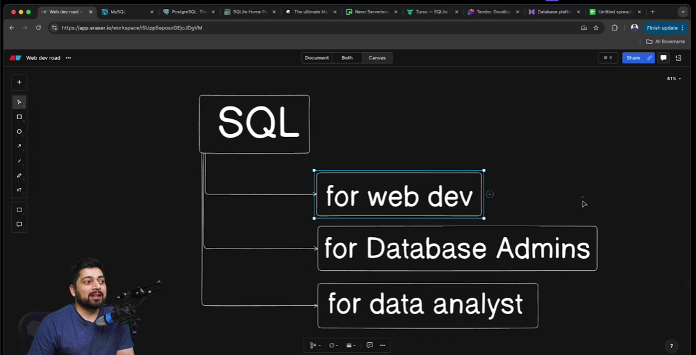
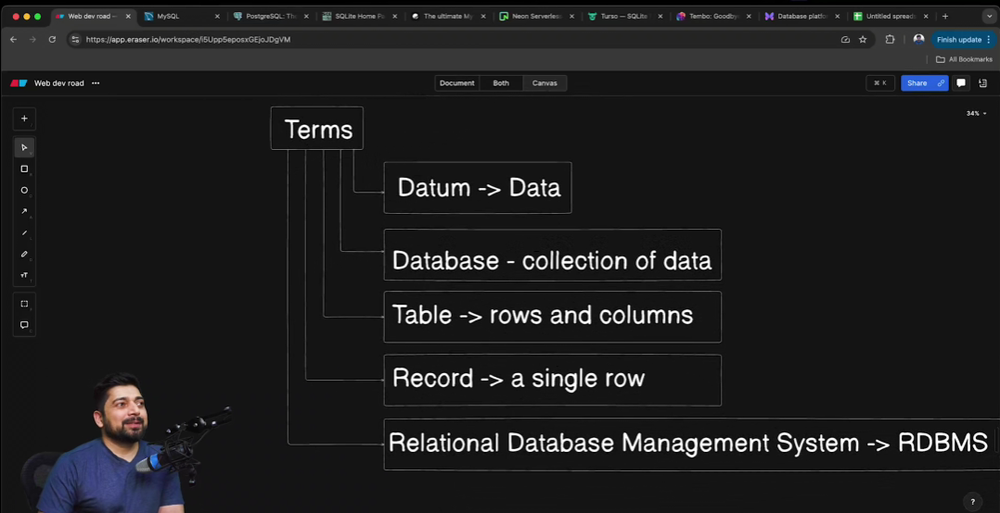
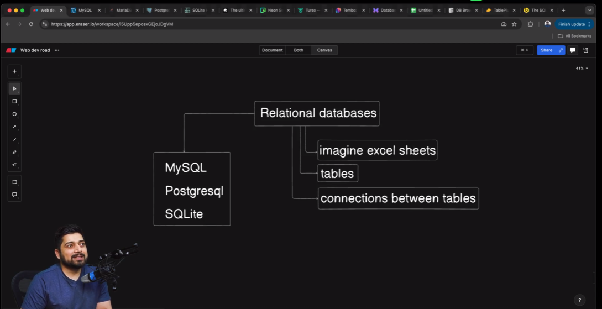

# Day 1 - Master SQL for Web developers

- Introduction to SQL for web developers
- SQL Terminologies
- MySQL , PostgreSQL and SQLite in the Real World

## Introduction to SQL for web developers
- SQL :- Structured Query Langugage
- A language used in quering the database 

- SQL for web dev, database admins , data analyst
- depends on the level 
- we are foucsing on web dev

## SQL Terminologies

- 
- database - collection of data
- table -> rows and columns
- record -> a sinlge row 
- RDBMS

## MySQL , PostgreSQL and SQLite in the Real World

- 
- Realational Databases like MySQL, Postgresql, SQLite
- Imagine excel Sheets
- Tables 
- Connection between tables
- Oracle owns MySQL (it has paid as well as communitye edition)
- MariaDB 
- neonDB , Turso , tembo , planetScale, xata (SAAS)