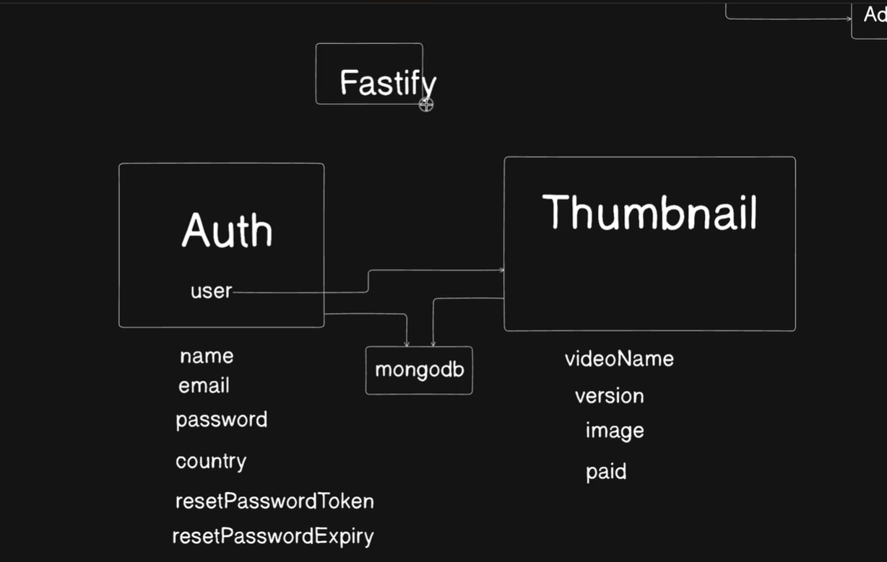
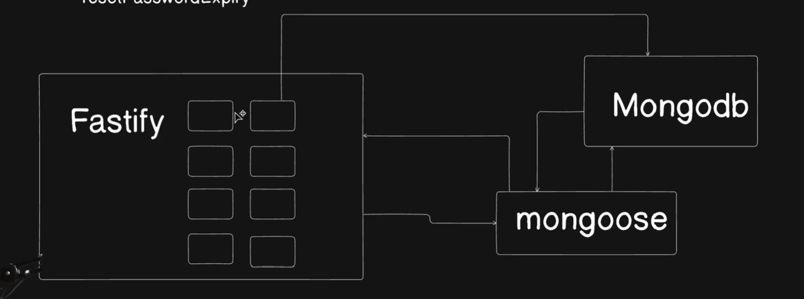

# Day 11:-  Master Fastify Framework by building a Complete Backend 

## A complete backend Project on Fastify 

- `express` is a framework 
- `hono` is also getting popular  
- `fastify` is also one framework 





- `fastify auth `
[`Fastify-auth github`](https://github.com/fastify/fastify-auth)

- There are lot of plugins which we will use 


## Reading fastify Docs together 


- [Fastify](https://fastify.dev/)
- powerful plugin architechture 
- least overhead
- 30k/s request/second

request      middleware      controller 
request      preHandler      handler

- there are lot of plugins available for fastify 


## Fastify server and Plugin Ecosystem 

installing packages
```js
npm i -D nodemon 
npm i fastify
```

server.js
```js
// Import the framework and instantiate it
import Fastify from 'fastify'
const fastify = Fastify({
  logger: true
})

// Declare a route
fastify.get('/', async function handler (request, reply) {
  return { hello: 'world' }
})

// Run the server!
try {
  await fastify.listen({ port: 3000 })
} catch (err) {
  fastify.log.error(err)
  process.exit(1)
}
```


