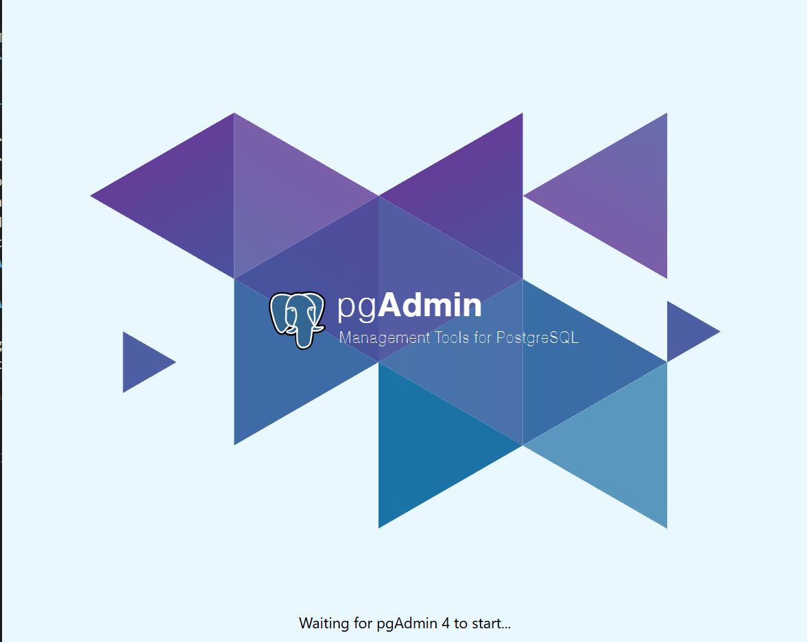

# Day 2 - Master SQL for Web Developers

## How to Install PostgreSQL on a Local Machine 

- Default PostgreSQL port is **5432** (commonly exposed in Docker containers)
- Installation of PostgreSQL on:
  - Windows / macOS / Linux
- Setting up a database user and password
- Verifying installation using `psql` command-line tool
- Usage of **pgAdmin 4** for database management

## A Tour of pgAdmin 4 (PostgreSQL)

- Overview of pgAdmin 4 interface
  - Servers, Databases, Schemas, Tables
- Running basic SQL queries using the Query Tool
- Creating tables and inserting sample data
- Viewing logs and connection status
- **Moon Modeler**
  - Professional data modeling tool
  - Mainly used for **NoSQL**, but also supports SQL databases
  - Useful for visual ER diagrams

## MySQL and MySQL Workbench Installation and Tour 

- Installing MySQL Server
- Setting root password and default port (**3306**)
- Overview of MySQL Workbench
  - SQL Editor
  - Data modeling (ER diagrams)
  - User and schema management
- Basic comparison: PostgreSQL vs MySQL (use cases)
