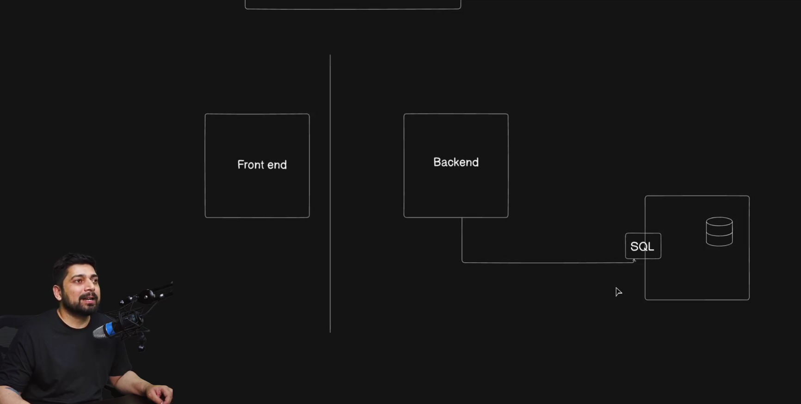

# Day 7 – Master SQL for Web Developers

## Aggregate Functions and Inner Functions in SQL

### Aggregate Functions

**Aggregate functions** perform calculations on a set of rows and return a single value.  
They are commonly used with the `GROUP BY` clause to summarize data.

### Common Aggregate Functions
- `COUNT()` – Counts the number of rows
- `SUM()` – Calculates the total of a numeric column
- `AVG()` – Finds the average value
- `MIN()` – Returns the smallest value
- `MAX()` – Returns the largest value

---

## Example Table: `employees`

| emp_id | name  | department | salary |
|------:|-------|------------|-------:|
| 1     | Asha  | IT         | 50000  |
| 2     | Rahul | IT         | 60000  |
| 3     | Neha  | HR         | 45000  |
| 4     | Aman  | HR         | 40000  |


## Examples

### 1. Count total employees
```sql
SELECT COUNT(*) AS total_employees
FROM employees;
```

### 2. Sum of all salaries

```sql
SELECT SUM(salary) AS total_salary
FROM employees;
```

### 3. Average salary per department

```sql
SELECT department, AVG(salary) AS avg_salary
FROM employees
GROUP BY department;
```

### 4. Highest and lowest salary

```sql
SELECT MAX(salary) AS highest_salary,
       MIN(salary) AS lowest_salary
FROM employees;
```

---

## Inner Functions (Nested Functions / Subqueries)

Inner functions in SQL usually refer to:

* Nested functions (a function inside another function)
* Subqueries (an inner query inside an outer query)

---

## Nested Functions Example

```sql
SELECT ROUND(AVG(salary), 2) AS avg_salary
FROM employees;
```

* `AVG(salary)` → inner function
* `ROUND()` → outer function

---

## Subquery Example

```sql
SELECT name, salary
FROM employees
WHERE salary > (
    SELECT AVG(salary)
    FROM employees
);
```

---

## Subquery with Aggregate Function

```sql
SELECT department
FROM employees
GROUP BY department
HAVING AVG(salary) = (
    SELECT MAX(avg_salary)
    FROM (
        SELECT AVG(salary) AS avg_salary
        FROM employees
        GROUP BY department
    ) AS dept_avg
);
```

---

## Moving Towards ORM – Prisma and Drizzle



### Prisma

* Type-safe ORM
* Best for complex schemas

Documentation:
[https://www.prisma.io/docs/getting-started](https://www.prisma.io/docs/getting-started)

### Drizzle

* Lightweight
* SQL-first
* Performance-focused

