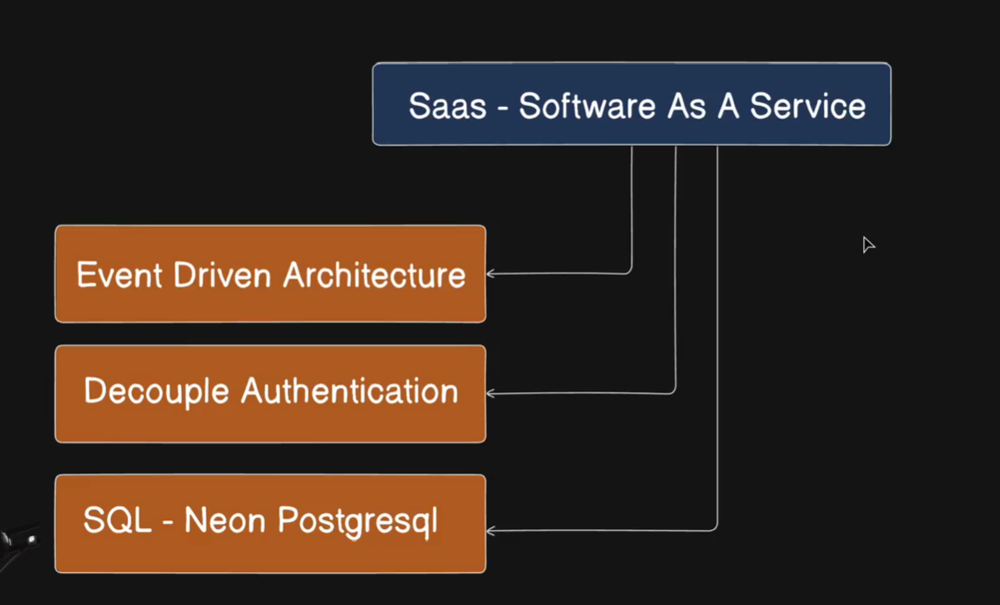
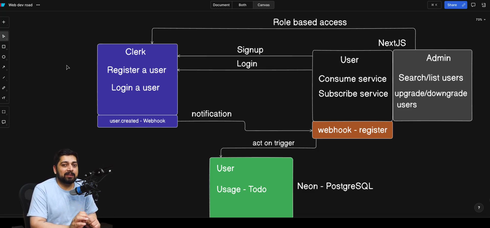

# Day 8 - Event Driven Architechture - FullStack Project

## Let's build a SAAS Starter Template with Clerk and NextJS

interesting case study 
- sell the products 
- best payment provider we chose 
- there was problem model that injected in that project 
- when a user comes and buys a things and purchase failed its a common problem 
- it does not fail immediately payment aggregator retry it and payment gone but the product is not there
- still a commmon problem 
- this problem is solved using event driven architechture

Q - How can we solve and mitigate these problems 
Event driven architechture 

- decoupling authentication system 
- nextjs 
- work on the features 
- clerk as an authentication (superpower)
- how these tunnel proxies work 
- ngrok and testing system setups 
- starter template for the SAAS 

neon database
clerk authentication 
ngrok 
full tunneling process 
will have subscribe to unlock more SAAS 
how can we triggers webhooks 

SAAS 
- event driven architecture 
- decouple authentication 
- SQL neon postgresql   

## Event Driven Architechture - A Guide on Clerk WebHooks

Event Driven Architechture 

event happens
you goto know about it 
you react to it

