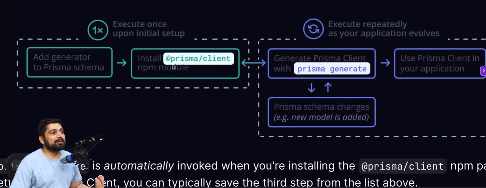
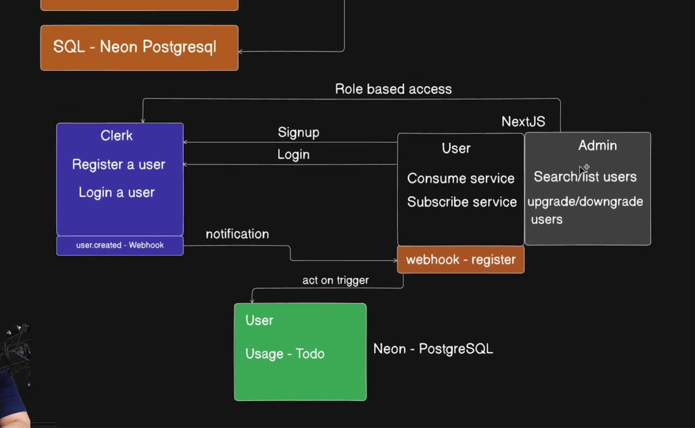

# Day 9 - Event Driven Architechture - FullStack Project 

## Handle NeonDB(PostgreSQL) with NextJs

ORM to choose - NeonDB 

installing the primsa and init postgresql 
```js
npm install primsa --save -dev
npx prisma init --datasource-provider postgresql 
```

clients to work with 
step 1 :- write all the model here 
step 2 :- migrate these models into the database 
step 3 :- `npx prisma format` to format 
step 4 :- `npx prisma migrate dev --name init` to migrate 
step 5 :- `npm prisma generate` generate client prisma

Cascading effect 

- connecting the database prisma in nextjs 
- orm layer - next app/ express app 


- `lib > prisma.ts`

## How to handle Custom Signup Flow in Clerk 

- customising the custom signup flow in clerk 
- checklist 
    - user fills out and submits the signup form 
    - clerk creates the user and intiates email verification 
    - user enters the email verification code 
    - clerk verfies the code and logs the user in , redirecting them 

- learn to build the custom sigup and signin pages yourself 
- lot of people blame clerk for basic things but they have not read the docs 

- created the singnup and signin > pages.tsx by making the state

signup.jsx
```js
/* eslint-disable @typescript-eslint/no-explicit-any */
"use client";

import { useState } from "react";
import { useSignUp } from "@clerk/nextjs";
import { useRouter } from "next/navigation";
import Link from "next/link";
import { Input } from "@/components/ui/input";
import { Button } from "@/components/ui/button";
import {
  Card,
  CardHeader,
  CardTitle,
  CardContent,
  CardFooter,
} from "@/components/ui/card";
import { Label } from "@/components/ui/label";
import { Alert, AlertDescription } from "@/components/ui/alert";
import { Eye, EyeOff } from "lucide-react";

export default function SignUp() {
  const { isLoaded, signUp, setActive } = useSignUp();
  const [emailAddress, setEmailAddress] = useState("");
  const [password, setPassword] = useState("");
  const [pendingVerification, setPendingVerification] = useState(false);
  const [code, setCode] = useState("");
  const [error, setError] = useState("");
  const [showPassword, setShowPassword] = useState(false);
  const router = useRouter();

  if (!isLoaded) {
    return null;
  }

  async function submit(e: React.FormEvent) {
    e.preventDefault();
    if (!isLoaded) {
      return;
    }

    try {
      await signUp.create({
        emailAddress,
        password,
      });

      await signUp.prepareEmailAddressVerification({ strategy: "email_code" });

      setPendingVerification(true);
    } catch (err: any) {
      console.error(JSON.stringify(err, null, 2));
      setError(err.errors[0].message);
    }
  }

  async function onPressVerify(e: React.FormEvent) {
    e.preventDefault();
    if (!isLoaded) {
      return;
    }

    try {
      const completeSignUp = await signUp.attemptEmailAddressVerification({
        code,
      });
      if (completeSignUp.status !== "complete") {
        console.log(JSON.stringify(completeSignUp, null, 2));
      }

      if (completeSignUp.status === "complete") {
        await setActive({ session: completeSignUp.createdSessionId });
        router.push("/dashboard");
      }
    } catch (err: any) {
      console.error(JSON.stringify(err, null, 2));
      setError(err.errors[0].message);
    }
  }

  return (
    <div className="flex items-center justify-center min-h-screen bg-background">
      <Card className="w-full max-w-md">
        <CardHeader>
          <CardTitle className="text-2xl font-bold text-center">
            Sign Up for Todo Master
          </CardTitle>
        </CardHeader>
        <CardContent>
          {!pendingVerification ? (
            <form onSubmit={submit} className="space-y-4">
              <div className="space-y-2">
                <Label htmlFor="email">Email</Label>
                <Input
                  type="email"
                  id="email"
                  value={emailAddress}
                  onChange={(e) => setEmailAddress(e.target.value)}
                  required
                />
              </div>
              <div className="space-y-2">
                <Label htmlFor="password">Password</Label>
                <div className="relative">
                  <Input
                    type={showPassword ? "text" : "password"}
                    id="password"
                    value={password}
                    onChange={(e) => setPassword(e.target.value)}
                    required
                  />
                  <button
                    type="button"
                    onClick={() => setShowPassword(!showPassword)}
                    className="absolute right-2 top-1/2 -translate-y-1/2"
                  >
                    {showPassword ? (
                      <EyeOff className="h-4 w-4 text-gray-500" />
                    ) : (
                      <Eye className="h-4 w-4 text-gray-500" />
                    )}
                  </button>
                </div>
              </div>
              {error && (
                <Alert variant="destructive">
                  <AlertDescription>{error}</AlertDescription>
                </Alert>
              )}
              <Button type="submit" className="w-full">
                Sign Up
              </Button>
            </form>
          ) : (
            <form onSubmit={onPressVerify} className="space-y-4">
              <div className="space-y-2">
                <Label htmlFor="code">Verification Code</Label>
                <Input
                  id="code"
                  value={code}
                  onChange={(e) => setCode(e.target.value)}
                  placeholder="Enter verification code"
                  required
                />
              </div>
              {error && (
                <Alert variant="destructive">
                  <AlertDescription>{error}</AlertDescription>
                </Alert>
              )}
              <Button type="submit" className="w-full">
                Verify Email
              </Button>
            </form>
          )}
        </CardContent>
        <CardFooter className="justify-center">
          <p className="text-sm text-muted-foreground">
            Already have an account?{" "}
            <Link
              href="/sign-in"
              className="font-medium text-primary hover:underline"
            >
              Sign in
            </Link>
          </p>
        </CardFooter>
      </Card>
    </div>
  );
}

```


## Clerk Middleware Guide for Role Based Access

middlewares 



